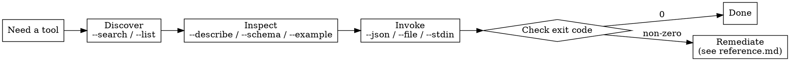

# Using MCP tools via ToolBox (`tlbx run`)

## Overview

ToolBox is a local gateway that fronts whatever MCP servers a user has configured. The `tlbx run` command lets you **discover and call any of those tools straight from the shell** — no MCP wiring, and they don't need to be loaded into your context. If a task needs a capability ToolBox exposes and `tlbx` is on the machine, reach for it here.

One command does everything, in three beats: **discover → inspect → invoke**.

Tools are namespaced `<server>__<tool>`. You can pass that exposed name as one argument, or pass the server and tool as two: `tlbx run acme create_item` ≡ `tlbx run acme__create_item`.

## When to use

- A task needs a service the user has put behind an MCP server, and `tlbx` exists.
- You're under progressive disclosure (the upstream tools aren't in your tool list) but still need them.
- You don't have native MCP wiring but you do have a shell.

**Don't use for:** configuring ToolBox itself (`tlbx setup`, `server add-*`, `auth login`) — that's the user's setup. This skill is about _calling_ already-configured tools. If nothing is configured, say so; don't add a server yourself.

## The loop



### 1. Discover

```bash
tlbx run --search "create item"        # rank every enabled tool by relevance
tlbx run <server> --search "item"      # scope the search to one server
tlbx run <server> --list               # list one server's tools
tlbx run --list                        # list every enabled tool
```

### 2. Inspect (before you guess arguments)

```bash
tlbx run <server> <tool> --describe    # required/optional fields + an example call
tlbx run <server> <tool> --schema      # raw JSON Schema
tlbx run <server> <tool> --example     # a JSON skeleton you can fill in
```

### 3. Invoke

```bash
tlbx run <server> <tool> --json '{"title":"..."}'
tlbx run <server> <tool> --file ./args.json
echo '{"title":"..."}' | tlbx run <server> <tool> --stdin
```

`--json`, `--file`, `--stdin` are mutually exclusive — pass exactly one. Tools that take no arguments need no input flag.

## Read the result programmatically

When stdout is **not** a TTY (i.e. whenever you capture output), `tlbx run` defaults to `--output json` and prints a stable envelope:

```json
{
  "ok": true,
  "server": "acme",
  "tool": "create_item",
  "exposedName": "acme__create_item",
  "result": {
    /* MCP CallToolResult */
  }
}
```

On failure, `ok` is `false` and `error` carries `{ kind, message }`. Diagnostics always go to **stderr**; stdout stays clean. Pass `--output text` for just the text content, or `--output mcp` for the raw `CallToolResult`.

## Branch on the exit code — don't parse stderr

Each failure class has its own code, so you can react without scraping text:

| Code | Meaning                 | What to do                                                   |
| ---- | ----------------------- | ------------------------------------------------------------ |
| 0    | success                 | use the result                                               |
| 1    | tool/upstream error     | read `error.message`; fix inputs or report                   |
| 2    | usage / bad input       | regenerate args with `--example`, fix flags                  |
| 3    | daemon failure          | retry once; then tell the user                               |
| 4    | unknown / disabled tool | re-`--list`; the message names the enable command            |
| 5    | auth required/expired   | do **not** retry blindly — see remediation in `reference.md` |
| 6    | timeout                 | retry once or narrow the request                             |

## Prerequisites (brief)

- The daemon **auto-starts** on first `tlbx run` — never run `tlbx serve` yourself.
- A server must already be configured. If `--list` is empty, the user hasn't added one; tell them, don't add it.

## Common mistakes

- **Guessing arguments.** Always `--describe` or `--example` first; don't hand-author JSON blind.
- **Parsing stderr for control flow.** Use the exit code and the JSON envelope instead.
- **Retrying on exit 5.** Auth needs the user to act (`tlbx auth login <server>`, or export a token and `tlbx stop`). Blind retries loop forever.
- **Trying to configure ToolBox.** Calling tools is in scope; adding servers and auth is the user's job.

**Full flag list, output envelope, and per-code remediation: see `reference.md`.**
